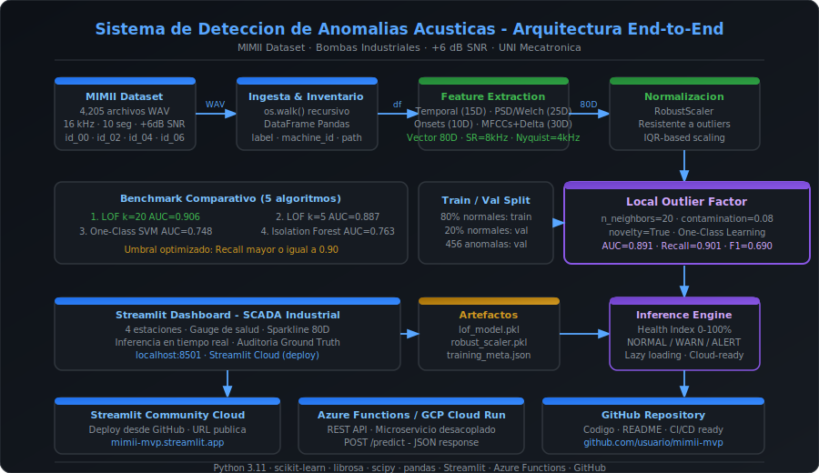

<div align="center">

# ⚙️ MIMII Anomaly Detection MVP

### Sistema de Mantenimiento Predictivo Acústico para Bombas Industriales

[](https://python.org)
[](https://streamlit.io)
[](https://scikit-learn.org)
[](https://azure.microsoft.com)
[](LICENSE)

**Proyecto de Egreso · Ingeniería Mecatrónica (9no ciclo) · Universidad Nacional de Ingeniería (UNI) · Lima, Perú**

[Demo en vivo](#demo) · [Instalación](#instalacion) · [Arquitectura](#arquitectura) · [Resultados](#resultados)

</div>

---

## Descripción

MVP de **Inteligencia Artificial Industrial** para detección de anomalías acústicas en bombas centrífugas bajo condiciones reales de ruido industrial (+6 dB SNR). El sistema implementa un pipeline completo de Data Engineering y MLOps con arquitectura modular, benchmarking comparativo de algoritmos y despliegue cloud-ready.

El proyecto parte del benchmark **MIMII Dataset** (Malfunctioning Industrial Machine Investigation and Inspection) y aborda el problema real de mantenimiento predictivo: detectar fallas antes de que ocurran, reduciendo paradas no programadas y costos operacionales.

---

## Arquitectura End-to-End



El pipeline está completamente desacoplado en tres capas:
- **Ingesta y Feature Engineering** — procesamiento de señales DSP en 80 dimensiones
- **Modelo ML** — Local Outlier Factor con umbral optimizado para industria
- **Interfaz y Cloud** — Streamlit Dashboard + microservicio REST API

---

## Características Principales

- **Pipeline 80D** — extracción manual de descriptores acústicos especializados para maquinaria rotativa
- **Benchmarking real** — comparación de 5 algoritmos sobre datos reales antes de elegir el modelo
- **Umbral industrial** — calibrado para Recall ≥ 0.90, priorizando la detección sobre las falsas alarmas
- **Dashboard SCADA** — tablero de control industrial con 4 estaciones de bomba en tiempo real
- **Auditoría técnica** — validación contra Ground Truth del dataset para transparencia del modelo
- **Cloud-ready** — motor de inferencia desacoplado compatible con Azure Functions y GCP Cloud Run

---

## Stack Tecnológico

| Capa | Tecnología | Propósito |
|------|-----------|-----------|
| **Lenguaje** | Python 3.11 | Pipeline completo |
| **Feature Engineering** | librosa · scipy · numpy | Extracción DSP |
| **ML** | scikit-learn | LOF · RobustScaler |
| **Data** | pandas | Inventario y manipulación |
| **UI** | Streamlit | Dashboard SCADA |
| **Cloud** | Azure Functions · GCP | Microservicio REST |
| **Versionamiento** | GitHub | CI/CD ready |

---

## Estructura del Proyecto

```
mimii-anomaly-detection/
├── app.py                          # Dashboard Streamlit
├── recalibrate.py                  # Recalibración de umbrales
├── requirements.txt
│
├── core/
│   ├── feature_extractor.py        # Pipeline 80D (DSP)
│   ├── model_trainer.py            # Entrenamiento LOF
│   └── inference_engine.py         # Motor de inferencia cloud-ready
│
├── scripts/
│   ├── benchmark.py                # Comparación 5 algoritmos
│   └── cloud_handler.py            # Handler Azure Functions / GCP
│
├── models/                         # Artefactos generados localmente*
│   └── training_meta.json
│
└── docs/
    └── architecture.svg            # Diagrama de arquitectura
```

> **Nota:** Los artefactos del modelo (`lof_model.pkl`, `robust_scaler.pkl`) no están incluidos en el repositorio. Genéralos ejecutando los pasos 4 y 5 de la instalación con el dataset descargado.

---

## Pipeline de Features — Vector 80D

El corazón del sistema es la extracción manual de descriptores acústicos especializados para bombas centrífugas, procesados a **8,000 Hz** (Nyquist = 4,000 Hz, rango mecánico relevante):

| Bloque | Dims | Descriptores |
|--------|------|-------------|
| **Temporales** | 15D | RMS, Crest Factor, Kurtosis, Skewness, ZCR, Shape/Impulse/Margin Factor, IQR, Energy |
| **PSD / Welch** | 25D | 10 bandas 0–4kHz, centroide espectral, ancho de banda, flatness, entropía, frecuencia pico |
| **Onsets** | 10D | Tasa de impactos, IOI mean/std, entropía de envolvente, regularidad rítmica |
| **MFCCs + Δ** | 30D | 13 coeficientes MFCC + 9 delta-1 + 8 delta-2 |

---

## Benchmark Comparativo

Antes de seleccionar el modelo final se evaluaron 5 algoritmos sobre los datos reales:

| Ranking | Algoritmo | AUC | F1 | Recall |
|---------|-----------|-----|-----|--------|
| 🥇 | **LOF k=20** | **0.906** | **0.756** | **0.620** |
| 🥈 | LOF k=5 | 0.887 | 0.778 | 0.653 |
| 🥉 | One-Class SVM | 0.748 | 0.573 | 0.407 |
| 4️⃣ | Isolation Forest | 0.763 | 0.159 | 0.087 |
| 5️⃣ | Elliptic Envelope | 0.653 | 0.000 | 0.000 |

---

## Resultados Finales

| Métrica | Valor | Interpretación |
|---------|-------|----------------|
| **AUC-ROC** | 0.891 | Alta capacidad discriminativa |
| **Recall** | 0.901 | 9 de cada 10 fallas detectadas |
| **Precision** | 0.558 | Trade-off aceptado para industria |
| **F1-Score** | 0.690 | Balance global |
| **Escenario** | +6 dB SNR | El más difícil del dataset |

> El umbral fue calibrado para **Recall ≥ 0.90** porque en mantenimiento predictivo industrial el costo de una falla no detectada supera al de una inspección innecesaria. Por cada falla real detectada se generan ~0.8 falsas alarmas — ratio operacionalmente aceptable.

---

## Instalación

```bash
# 1. Clonar repositorio
git clone https://github.com/PedroFernandez07/mimii-anomaly-detection.git
cd mimii-anomaly-detection

# 2. Instalar dependencias
pip install -r requirements.txt

# 3. Descargar dataset
# MIMII Dataset (6_dB_pump.zip) desde https://zenodo.org/record/3384388
# Extraer en ./pump/

# 4. Entrenar modelo
python -m core.model_trainer --data_dir "./pump" --output_dir "./models"

# 5. Recalibrar umbrales
python recalibrate.py --data_dir "./pump"

# 6. Lanzar dashboard
streamlit run app.py
```

---

## Demo
El dashboard simula un panel de control SCADA industrial con:

- **4 estaciones** de bomba monitoreadas (id_00, id_02, id_04, id_06)
- **Carga de audios WAV** para inferencia instantánea
- **Gauge de Índice de Salud** (0–100%) con escala cromática
- **Expandible de Auditoría** con Ground Truth vs. predicción del modelo
- **Live demo:** https://mimii-app.wonderfulfield-74501e25.eastus.azurecontainerapps.io/
---

## Despliegue en la Nube

El motor de inferencia está **desacoplado de la UI** para operar como microservicio:

```python
# Azure Functions
from core.inference_engine import predict

result = predict("pump_sound.wav", machine_id="id_00")
# {'status': 'NORMAL', 'health_index': 87.3, 'anomaly_score': -0.2341}
```

Ver `scripts/cloud_handler.py` para el handler completo de Azure Functions y GCP.

---

## Dataset

**MIMII Dataset** — Malfunctioning Industrial Machine Investigation and Inspection

- **Fuente:** Zenodo · [DOI: 10.5281/zenodo.3384388](https://zenodo.org/record/3384388)
- **Subset:** Pump · +6 dB SNR · 7.7 GB
- **Distribución:** 3,749 normales · 456 anómalas · ratio 9:1
- **Formato:** WAV · 16 kHz · 16-bit PCM · ~10 segundos por muestra

> Purohit, H. et al. (2019). *MIMII Dataset: Sound Dataset for Malfunctioning Industrial Machine Investigation and Inspection*. DCASE Workshop 2019.

---

## Autor

**Pedro Santiago**
Estudiante de Ingeniería Mecatrónica (9no ciclo) · Universidad Nacional de Ingeniería (UNI) · Lima, Perú
Especialización en curso: Data Engineering

[](https://www.linkedin.com/in/pedro-fernandez-avila)
[](https://github.com/PedroFernandez07)

---

<div align="center">
<sub>
Paradigma: One-Class Novelty Detection · Algoritmo: Local Outlier Factor · Stack: Python · scikit-learn · Streamlit · Azure
</sub>
</div>